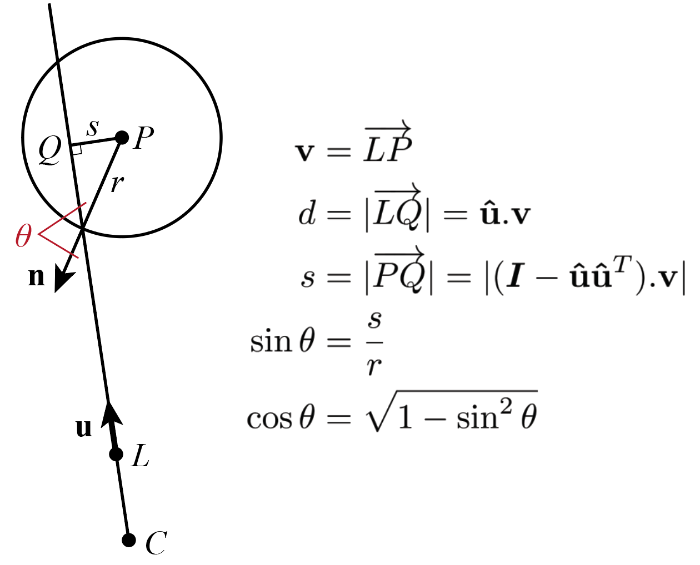

Library for presenting simple stimuli to a 3D model of the _Drosophila_ visual system used to compute  column 
activations in Mearns et al,, 2026 [1].

Original data are from Zhao et al., 2025 [2]. Mearns et al. remapped visual columns from FlyWire.

# About

This library is for projecting simple visual stimuli (spheres at different locations in the visual field) onto the
ommatidia of the left and right eyes. Each ommatidium is represented by two points: a lens and cone tip. The sight
lines of the ommatidia are straight lines defined by these two points.

The activation of an ommatidium to a given stimulus is defined as the cosine of the angle between the ommatidium sight 
line projected onto the stimulus and a normal vector on the surface of the stimulus at that point.

Models of a single eye are represented by the `EyeModel` class. For convenience, different preexisting models can be 
loaded using factory methods defined in `ZhaoDataset` and `MappedDataset` classes.

New datasets can be created using the `DatasetMapper` class, which aligns new hexagonal visual column maps to a
preexisting dataset to infer the corresponding 3D geometry of the new data.

For basic usage see accompanying `notebooks`.

# References

[1] Mearns, D.S., Park, Y., Shin, I., Murthy, M. A neural circuit for stereopsis in the fly. In prep. 

[2] Zhao, A., Gruntman, E., Nern, A. et al. Eye structure shapes neuron function in Drosophila motion vision. 
Nature 646, 135–142 (2025). https://doi.org/10.1038/s41586-025-09276-5
